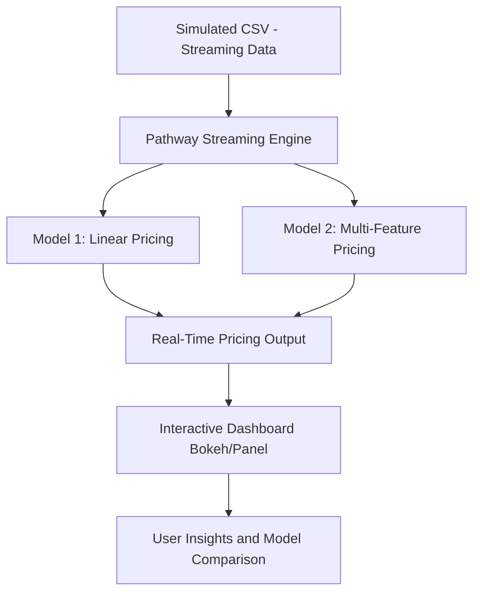

# Capstone Project on Real-Time Dynamic Pricing Models for Smart Urban Parking

A predictive analytics project designed to optimize urban parking through real-time dynamic pricing based on demand factors like occupancy, traffic, queue length, and special events. The project models multiple pricing strategies (Model 1 and Model 2), integrates real-time data simulation, and compares models via interactive visual dashboards.

---

## Tech Stack

- **Python**
- **Pathway** – real-time data stream processing
- **Bokeh & Panel** – interactive visualizations
- **Pandas & NumPy** – data manipulation
- **Scikit-learn** – linear regression & model fitting
- **Google Colab** – notebook development
- **Mermaid.js** – architecture diagrams

---

## Project Models

### 🔹 Model 1: Simple Linear Pricing
- Price is a linear function of occupancy
- Price<sub>(t+1)</sub> = Price<sub>(t)</sub> + α * Occupancy
- `α` estimated using real-time patterns 
- Real-time visualization per parking spot

### 🔹 Model 2: Feature-Based Demand Pricing
- Uses multiple features:  
  `Occupancy`, `QueueLength`, `Traffic`, `SpecialDay`, `VehicleType`
- Simulates prices based on assumed coefficients
- Recovers coefficients using regression to validate model
- More dynamic and granular control over price sensitivity

### 🔹 Model Comparison
- Unified dashboard for comparing pricing logic across all 14 parking spots
- Performance and sensitivity of each model visible in real-time

---

## Architecture Diagram



---

## Workflow & Pipeline

1. **Simulated Data Source**: CSV files continuously updated to mimic live parking spot data.
2. **Pathway Integration**: Processes data streams in real time using delta windows.
3. **Model 1**: Trains a simple linear model per parking spot using occupancy.
4. **Model 2**: Uses richer features with assumed coefficients to simulate price, then regresses back to estimate those coefficients.
5. **Visualization**: Each model's pricing for all 14 spots is visualized live using Bokeh and Panel.
6. **Model Comparison**: A notebook and dashboard compare results between Model 1 and 2 under identical scenarios.

---

## Folder Structure

```
.
├── Capstone Project - Model 1 Notebook.ipynb
├── Capstone Project - Model 2 Notebook.ipynb
├── Capstone Project - Model Comparison Notebook.ipynb
├── Capstone Project Report.pdf
├── Copy of dataset.csv
├── Model 1 Plots.pdf
├── Model 2 Plots.pdf
├── Model Comparison Plots.pdf
├── Model1_Output.csv
├── Model2_Output.csv
└── README.md
```

---

## How to Run

1. Open notebooks in Google Colab or JupyterLab.
2. Ensure required packages are installed:
   ```bash
   pip install pathway bokeh pandas panel
   ```
3. Run the Model 1 and Model 2 notebooks to see real-time pricing output.
4. Use the Comparison Notebook to view differences and performance of both models.

---

## Project Report

Refer to `Capstone Project Report.pdf` for in-depth methodology, assumptions, and performance analysis.

---

## Contributors

- Bhavya – Model design, real-time simulation, and dashboard development
